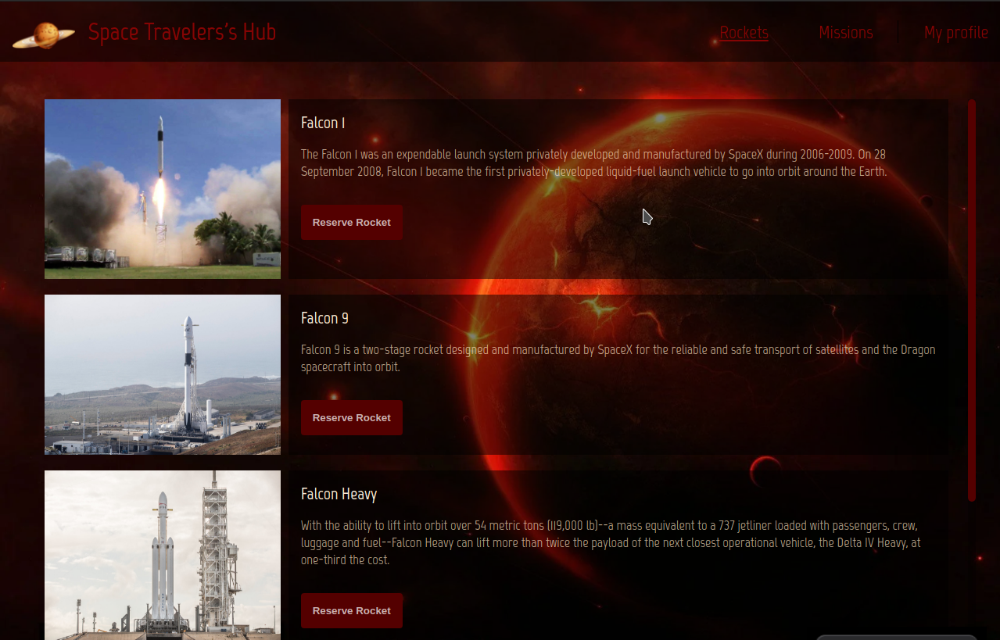
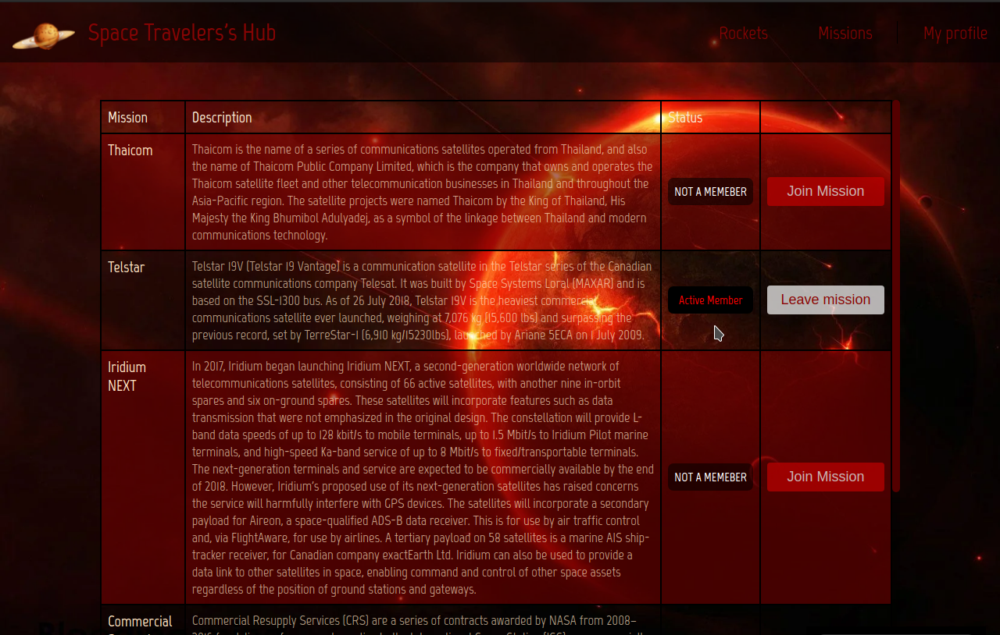
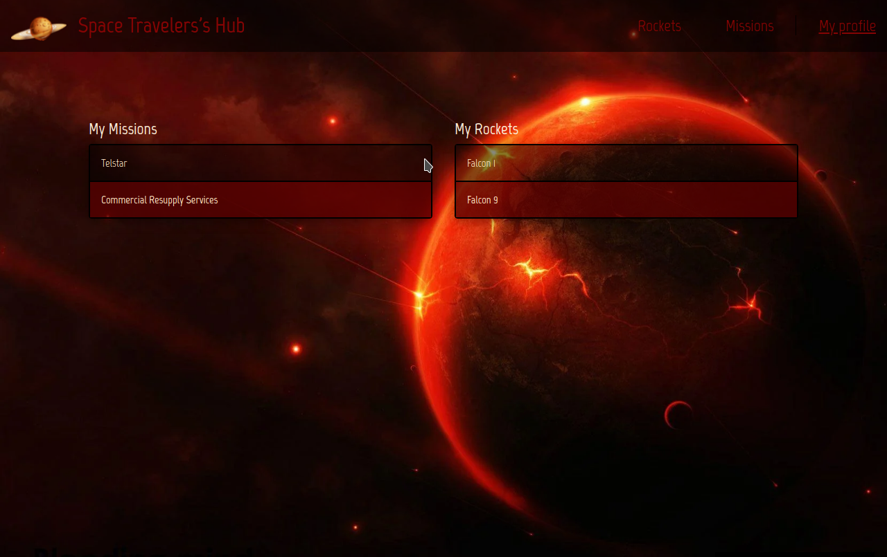

# Space-Travelers-Hub
 

Space-Travelers-Hub is an webapp where you can reserve a rocket and join a mission in outer space. Enjoy the interstellar voyage. Mars here we come!

## Live demo
[See Project](https://simongrchevski.github.io/)

## Presentational video
[See Video](...)

## Built With

- Javascript
- CSS
- React and Redux

## Getting Started

**To get the local copy of the project up and running you will need to run the following commands on your terminal:**

- `git clone git@github.com:SimonGrchevski/Space-Travelers-Hub.git`

And then In your terminal run : 

- `cd Space-Travelers-Hub`

To install all the available dependecies run:
- ``npm install``

To run this application locally :

- `npm start`

## Authors

👤 Simon Grchevski

- GitHub: [Github](https://github.com/SimonGrchevski)
- LinkedIn: [LinkedIn](https://www.linkedin.com/in/simon-grchevski-682935209/)
- Twitter: [Twitter](https://twitter.com/grchevski)

👤 Polina Stamenova

- GitHub: [Github](https://github.com/PolinaStamenova)
- LinkedIn: [LinkedIn](https://www.linkedin.com/in/polina-stamenova-a60766112/)

## 🤝 Contributing

Contributions, issues, and feature requests are welcome!